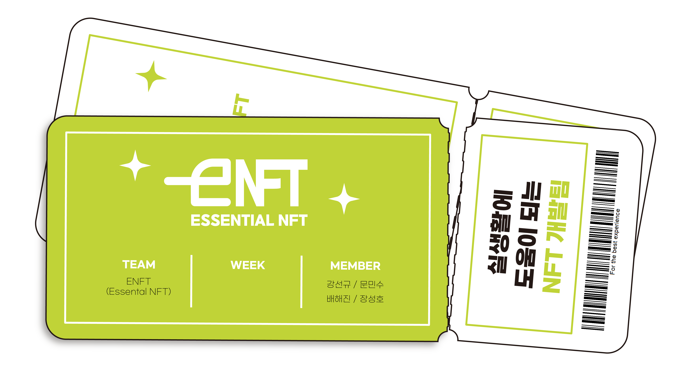

# ENFT - NFT 기반 헬스장 이용권 플랫폼



## 프로젝트 영상

<hr/>
<a href="https://www.youtube.com/watch?v=gN37djTY7C8">파란학기 ENFT팀 성과 발표</a> (시연 영상 2분 47초 ~ 5분 4초)

## 프로젝트 소개

<hr/>

ENFT는 **온라인으로 헬스장 이용권을 거래할 수 있는 NFT 플랫폼**입니다.

### 개발 배경

+ **헬스장 내 무단 출입 가능**

  주변 헬스장 조사한 결과 출입 인증을 전화번호 뒷자리로만 하는 곳이 많았습니다. 헬스장을 이용하는 사람의 전화번호 뒷자리만 알면, 무단으로 헬스장을 이용할 수 있었습니다.


+ **코로나 대유행**

  코로나가 대유행하면서 헬스장 무단 출입은 역학조사를 방해할 수 있습니다. 헬스장에 코로나 감염자가 발생했다고 가정하겠습니다. 헬스장 이용자인 A의 전화번호 뒷자리를 무단으로 사용한 B가 헬스장을 이용했을 때,
  전산상으로는 A가 이용한 것입니다. 이는 역학조사의 방해요소가 됩니다.


+ **오프라인 형태의 헬스장 이용권 발급 또는 양도 시스템**

  마찬가지로 코로나 대유행 당시 코로나 전파 위험을 줄이기 위해서, 오프라인 형태의 서비스를 비대면으로 전환하고자 합니다. 그리고 온라인으로 편하게 서비스를 이용할 수 있게끔 하고자 합니다.

### 개발 목표

+ **헬스장 내 무단 출입 방지**

  사용자에게만 발급되면서 인증 만료 기한이 있는 QR 코드를 사용해 다른 누군가가 헬스장 이용권을 도용하는 것을 방지하고자 합니다.


+ **온라인 헬스장 이용권 발급 및 양도 시스템**

  원하는 헬스장 선택부터 이용권 구매까지 모두 어플리케이션 내에서 진행할 수 있게끔하고자 합니다.


+ **구체적인 이야기를 위한 DM**

  헬스장과의 FAQ, 헬스장 이용권 양도자와의 흥정 등 개인별 구체적인 이야기를 위한 1대1 채팅 서비스를 제공하고자 합니다.


+ **개인간 헬스장 이용권 양도 정보 추적**

  헬스장 사장님 입장에서는 개인간 헬스장 양도를 진행했을 때, 최종적으로 누가 헬스장 이용권을 가지고 있는지 알고 있어야 합니다. 왜냐하면 헬스장 고객 명단을 관리해야 하기 때문입니다. 따라서 개인 간 거래가
  진행되더라도, 위조 없이 투명하게 거래 정보를 알 수 있어야 합니다.

## 핵심 기능 소개

<hr/>

<table>
<thead>
<th align="center">
<font style="vertical-align: inherit;">
헬스장 출입 QR 코드
</font>
</th>
</thead>
<tbody>
<tr>
<td align="center">


</td>
</tr>
<tr>
<td>
<strong>
<font style="vertical-align: inherit;">
각 헬스장 이용권 별로 QR 코드가 생성됩니다.
</font>
</strong>
</td>
</tr>
<tr>
<td>
<strong>
<font style="vertical-align: inherit;">
JWT를 사용하여 QR 코드는 30초 후에 만료됩니다.
</font>
</strong>
</td>
</tr>
</tbody>
</table>

<table>
<thead>
<th align="center">
<font style="vertical-align: inherit;">
헬스장 이용권 구매
</font>
</th>
</thead>
<tbody>
<tr>
<td align="center">


</td>
</tr>
<tr>
<td>
<strong>
<font style="vertical-align: inherit;">
헬스장 사장님에게 NFT 기반 헬스장 이용권을 클레이튼 코인으로 구매합니다. 
</font>
</strong>
</td>
</tr>
</tbody>
</table>

<table>
<thead>
<th align="center">
<font style="vertical-align: inherit;">
헬스장 이용권 양도
</font>
</th>
</thead>
<tbody>
<tr>
<td align="center">


</td>
</tr>
<tr>
<td>
<strong>
<font style="vertical-align: inherit;">
NFT 전송을 통해 소유하고 있는 헬스장 이용권을 다른 사람에게 양도할 수 있습니다.
</font>
</strong>
</td>
</tr>
</tbody>
</table>


<table>
<thead>
<th align="center">
<font style="vertical-align: inherit;">
사용자와의 1대1 채팅
</font>
</th>
</thead>
<tbody>
<tr>
<td align="center">


</td>
</tr>
<tr>
<td>
<strong>
<font style="vertical-align: inherit;">
헬스장 이용권 구매 또는 양도에 관한 구체적인 이야기를 나눌 수 있습니다.
</font>
</strong>
</td>
</tr>
</tbody>
</table>

## 기술 스택

<hr/>

+ **Flutter** 

  Android, iOS를 동시에 지원하는 모바일 어플리케이션 개발에 용이한 크로스 플랫폼 프레임워크입니다.


+ **GetX**

  Flutter의 상태 관리 라이브러리입니다. BuildContext가 필요하지 않아 위젯 트리에 의존하지 않는다는 장점이 있습니다. 

  처음에는 상태 관리 라이브러리로 Provider를 사용하고 있었습니다. 해당 라이브러리에서는 BuildContext를 필요로 하기에, 위젯 트리에서 로직을 작성하는 일이 잦았습니다. 프로젝트 크기가 커지면서 더이상 손 쓸 수 없을 정도로 코드가 복잡해졌습니다. 뷰와 로직의 분리를 위해서 BuildContext가 필요 없는 GetX로 마이그레이션하게 되었습니다.


+ **Klip**

  카카오에서 제공하는 코인 지갑입니다. 프로젝트는 한국 서비스였기 때문에, 사람들에게 익숙한 카카오 서비스이면서 한글로 서비스가 제공되기에 선택했습니다.


+ **Klaytn API Service**

  클레이튼은 전송 속도가 빠르며 수수료 대납이 가능한 블록체인 네트워크입니다. 비즈니스 모델에서 거래 수수료 대납이 중요한 역할을 할 것 같아 클레이튼을 선택했습니다.


## 폴더 구조
<hr/>

```sh
 lib
├─ app
│   ├─ binding # Controller를 DI에 등록하기 위한 Binding 관련 폴더
│   ├─ constant # Color, Size와 같은 상수 관련 폴더
│   ├─ controller # Controller 관련 폴더
│   ├─ data # Repository layer 관련 폴더
│   │   ├─ model # Entity 관련 폴더
│   │   ├─ provider # API 통신을 위한 Client 관련 폴더
│   │   └─ repository # Repository 관련 폴더
│   ├── route # Routing 관련 폴더
│   └── ui # UI 관련 폴더
└── main.dart
```

## 회고
<hr/>

https://elemental-button-97b.notion.site/ENFT-f1463584c963481fb0523173072c42fb